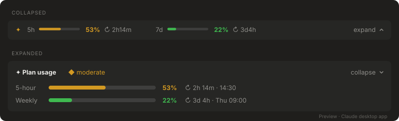

# usage-band

A slim band above the Claude Code prompt that shows how much of your Claude plan you've used: the **5-hour** window and the **weekly** limit, each with a progress bar, a percentage and a countdown to its reset.

**Works in the Claude desktop app** (the Code tab on Windows and macOS) **and in the Claude Code terminal.** In the desktop app it draws native rounded bars, icons and a hover tooltip; in the terminal it uses text characters.



In the terminal it draws with text characters:

```
Expanded
╭──────────────────────────────────────────────────────────────╮
│ ✦ Plan usage  ◆ moderate                                   ⌄ │
│ 5-hour  ████████████▋───────────  53%  ↻ 2h 14m · 14:30      │
│ Weekly  █████▍──────────────────  22%  ↻ 3d 4h · Thu 09:00   │
╰──────────────────────────────────────────────────────────────╯

Collapsed
 ✦ 5h ━━━━━━╸───── 53% ↻ 2h14m  ·  7d ━━╸───────── 22% ↻ 3d4h        ⌃
```

## Features

- **Two windows:** the 5-hour limit and the weekly limit, side by side.
- **Color by level:** green under 50%, amber from 50–80%, red over 80%. The ✦ icon takes the color of the higher window.
- **Reset countdown:** shows how long until each window resets, plus the clock time, updated every minute.
- **Warning toast:** one notification when a window passes 90%, once per reset period.
- **Responsive:** the band sizes itself to the window. Bars shrink as it narrows, and on a narrow window the collapsed line keeps just the percentages.
- **Collapse to one line:** the chevron switches between the full view and a single thin line. Your choice is remembered across sessions.
- **Works in the Claude desktop app and the terminal:** one plugin, drawn natively for each. The desktop app gets smooth bars, an ⓘ tooltip with the reset times and a chevron button; the terminal gets text bars with the reset times inline.

## Requirements

- **Claude Code 2.1.286 or newer.** Earlier versions don't support plugin hook modules or the events this band uses. Check with `claude --version`. The Claude desktop app keeps its own copy of Claude Code up to date, so it already qualifies once the app is current.
- **A Claude Pro or Max subscription.** The 5-hour and weekly figures only exist on subscription plans. With an API key, the band shows "waiting for first response…".

## Installation

Run these two commands in a terminal:

```bash
claude plugin marketplace add YossiAbutbul/claude-usage-band
claude plugin install usage-band@claude-usage-band
```

Then start a new Claude Code session. The band appears above the prompt and fills in after Claude's first reply.

This works for the terminal and for the Claude desktop app, since both read the same installed plugins.

### Try it once without installing

To load it for a single terminal session only:

```bash
git clone https://github.com/YossiAbutbul/claude-usage-band.git
claude --plugin-dir ./claude-usage-band
```

## Usage

| Action | How |
| --- | --- |
| Collapse or expand (desktop app) | Click the chevron at the right of the band |
| See when the windows reset (desktop app) | Hover the ⓘ icon next to the chevron |
| Collapse or expand (terminal) | Click **⌄** / **⌃** on the band |
| Collapse or expand from the prompt | Type `/usage-band` |
| Keyboard (terminal) | Focus the band, then press `u` |

The numbers update after each reply from Claude, since that's when your plan usage is reported. The reset countdown updates every minute on its own.

## Customizing

All settings are constants at the top of [`hooks/register.tsx`](hooks/register.tsx):

| Constant | What it controls | Default |
| --- | --- | --- |
| `WARN_AT` | Percentage that triggers the warning toast | `90` |
| `BAR_CELLS` | Bar width in the expanded card (terminal) | `24` |
| `MINI_CELLS` | Bar width in the collapsed line (terminal) | `12` |
| `level()` | Color thresholds and colors | 50% / 80% |
| `pill()` sizes | Bar size in the desktop app | `84×5` collapsed, `220×8` expanded |

Fork the repo, change the constants, and install from your fork: `claude plugin marketplace add <you>/claude-usage-band`.

## Updating

```bash
claude plugin marketplace update claude-usage-band
claude plugin update usage-band@claude-usage-band
```

Then start a new session.

## Uninstalling

```bash
claude plugin uninstall usage-band@claude-usage-band
claude plugin marketplace remove claude-usage-band
```

## Troubleshooting

- **The band doesn't appear.** Check `claude --version` is 2.1.286 or newer and that `claude plugin list` shows `usage-band@claude-usage-band` as enabled. Then start a new session.
- **It says "waiting for first response…".** Send any message; the figures arrive with Claude's reply. If it stays there, your account isn't on a subscription plan.
- **The band shows twice.** The plugin is loaded from two places, for example the installed plugin plus a `--plugin-dir` flag. Remove one.
- **Errors.** Run `claude --debug`; lines starting with `usage-band:` explain what failed.

## License

[MIT](LICENSE)
